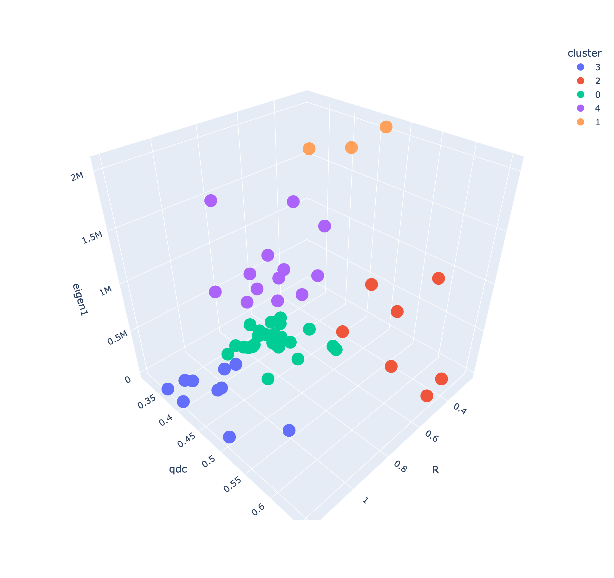
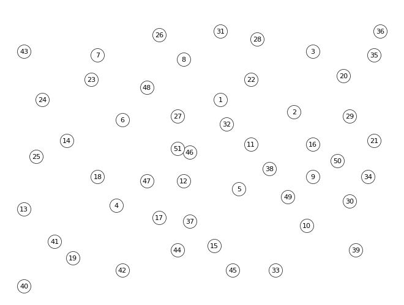
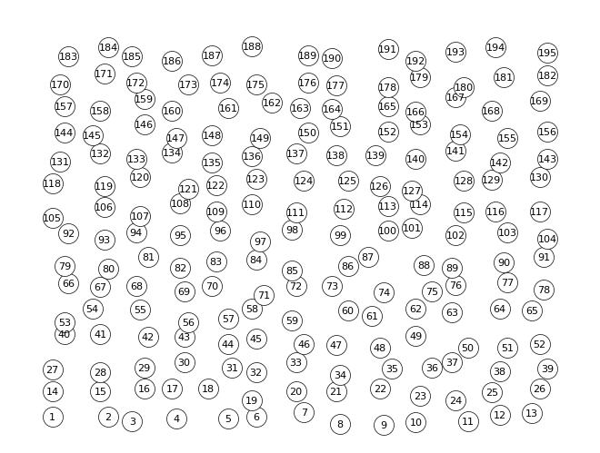
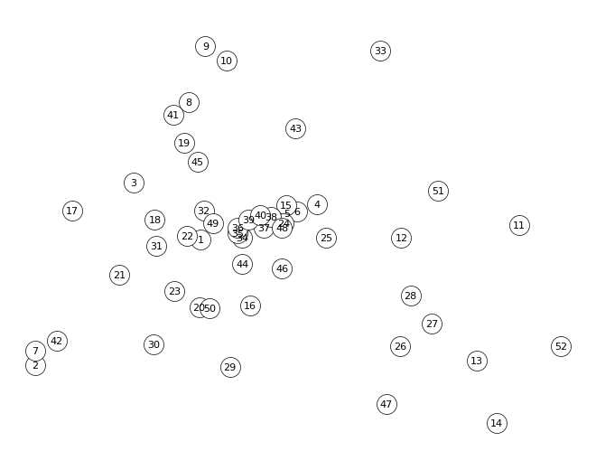
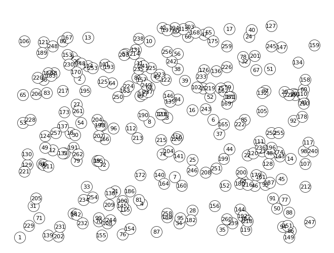
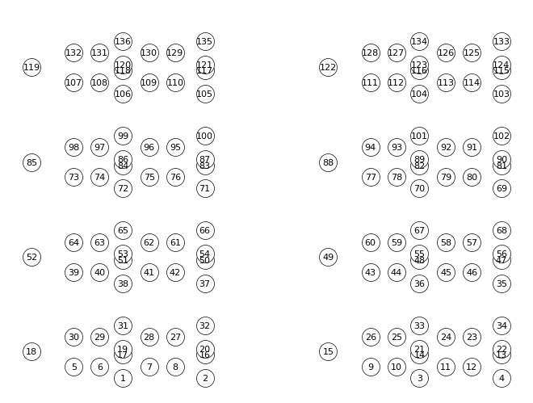
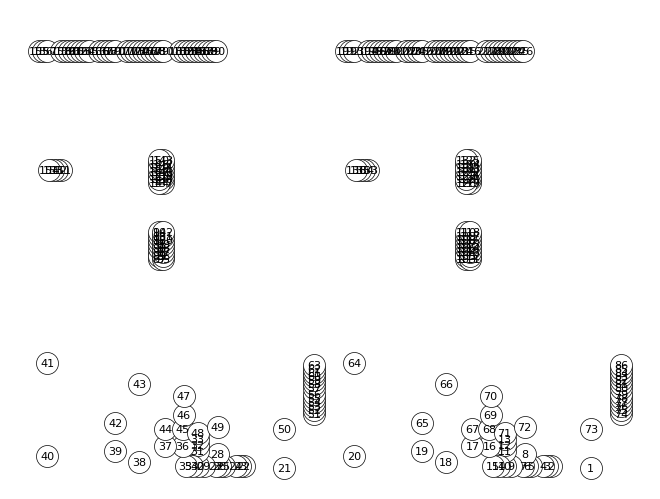
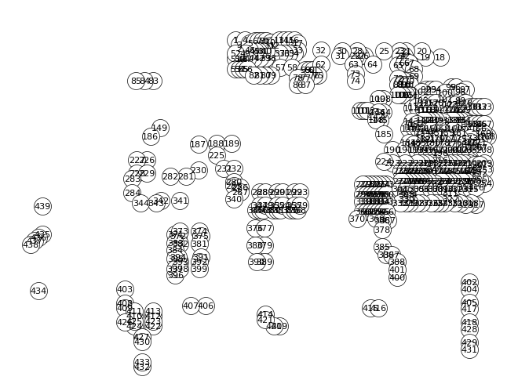
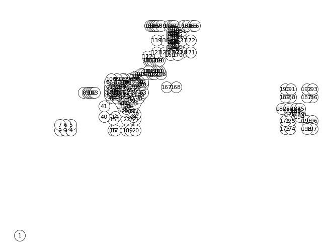
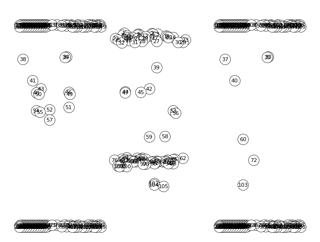

# XF-OPT/META
## E**X**perimentation **F**ramework and (Hyper-)Parameter **Opt**imization for **Meta**heuristics

This python package provides and easy-to-use and modular framework for implementing metaheuristic algorithms and corresponding problems (e.g., TSP, QAP). Futhermore it provides functions/modes for optimizing the paramters used in the metaheuristics using Hyperparamter optimization algorithms (e.g., Random Search), analyzing multiple runs of an implemented metaheurisitc algorithm or simply running said algorithm interactively.

## 1. Overview

As of now, the package provides a CLI-based control over its features.
Following the installtion instructions, one should be able to start the programm using:
```
python main.py
```
Please refer to the help section for information on the optional parameters:
```
python main.py -h
```

There are three pre-definded use cases:

- Run Mode (--mode run, default)
- Experimentation Mode (--mode exp)
- Optimization Mode (--mode opt)

Each case is provided with a default TSPLIB problem instance (rat195), that can be changed as well, even using different problem types, like QAP for example.

That being said, the package constists of multiple python modules/classes, that can be used interchangeably and connected as neccesary without the use of the CLI.

A web-based user interface and dashboard for graphs is also planned.

## 2. Installation

***Note:**\
This package only works with Python version >= 3.10.
But, since speed is a major factor, when it comes to metaheuristics, Python version 3.11 is recommended due to even further performance improvements.*

Start by cloning the repository to your local system.
Then, open a terminal in the `/src` directory, where the python code is located, and install the dependencies, either directly via pip
```
pip install -r requirements.txt
```
or using you favorite python environment manager (e.g., venv or conda).

Now you are ready to start the script using
```
python main.py
```


## 3. Experimental Setup and Tests

### 3.1. Choice of problem instances
For the problem instance category, the symmetric TSP was chosen, not only because it relates to previous work done with this algorithm (see paper), but also because it can be generalized to lots of different, relevant problems, especially in logistics. 

The TSP instance test cases will be of the popular TSPLIB, since they are tried and tested by lots of publications and also have the benefit of having the optimal solution known for each of the problems.
Besides giving the weights in standard 2D Euclidean form, the are also geographical distance problem instances or distance matrices. The thesis will focus on Eucledian 2D instances for simplicity, but the software itself can handle any type of TSP edge weight type.

The thesis will focus especially on the dynamic TSP (as explained in the chapter before). However, the dynamic part is implemented by the package itself, not the TSPLIB.
All TSPLIB instances have varying number of cities (henceforth called dimension) and oftentimes certain characteristics by which the cities are placed in the space, sometimes describes within the TSPLIB file (under COMMENT).
To quantify these instances the mean and median distance between nodes was also calculated. This gives the opportunity to select a meaningful, disjunct subset of problem instances, without using too many, since the computational effort to run the larger instances is pretty significant (more on that later).

The selection of problem instances is influenced by two metrics: dimension and city placement characteristic.
Since this implementation of the HSPPBO algorithm scales linearly with the dimension n, so O(n) time complexity, and the process of hyperparameter optimization runs the algorithm around hundred times, with the optimization being repeated several times for each dynamic configuration and problem instance, the maximum dimension used will be around 400. The lower bound for the dimension n will be 50, since smaller instances, will make it difficult to make out any placement characteristics. This results in dimension bound by the interval [50,450], which is then roughly categorized into smaller instances (50-250 cities) and larger instances (250-450) instances.

The city placement characteristic is determined with the help of the following statistical values calculated for each TSPLIB instance using the corresponding distance matrix:

- mean
- median
- coeff_var: coefficient of variation (https://en.wikipedia.org/wiki/Coefficient_of_variation)
- qdc: quartile coefficient of dispersion (https://en.wikipedia.org/wiki/Quartile_coefficient_of_dispersion)
- R: regularity index (according to [[1]](#1) and [[2]](#2))
- eigen1: the first eigenvalue ("close relation to the average length of all Hamiltonian cycles in a TSP instance" according to [[3]](#))
- eigen_gap: gap between the first two largest eigenvalues

These values were calculated for all TSPLIB instances with a dimension smaller than 1000 and with a valid edge weight type for the used python package (this excluded ATT, EXPLICIT and CEIL_2D problems).
The results can be found [here](problems/metadata.json).

Three methods for determining the placement characteristic are possible:
1. Using value ranges for the regularity index R to distinct between structures (according to [1]](#) and [[2]](#2))
2. Using the value ranges of the gap between the first two (largest) eigenvalues to distinct between structures (according to [[4]](#4))
3. Using KMeans clustering with the parameters qdc, R and eigen1 to automatically generate clusters.

Since methods one and two rely on value ranges, they already give the inherent structural property of each value range. These are:
- heavy_cluster
- semi_cluster
- random
- semi_regular
- regular

Researching and applying each of these methods resulted in a mixed outcome. 
The first method was first validated according to the data from [[1]](#1) and [[2]](#2). The test instances used for that were from the Tnm test dataset by the University of Bonn ([example](problems/tsp/visualizations/Tnm52.png)) and a triangle lattice generated via the python NetworkX package. The Tnm instances were used to reproduce the R values from [[2]](#2), while the triangle lattice indeed proofed to have an R value of 2 according to [[1]](#1).
With that foundation established, the first method worked generally well, being able to categorize each problem into a satisfying group. But, it was heavily influenced by artificial patterns, such as pcb442 or ts225, classifying these as randomly distributed (R=1).

The second method proved unpractical to implement, since it could not be directly calculated on the distance matrix and instead would use its Laplacian matrix. The paper [[4]](#4) also bases its theory upon a positive semi-definite matrix, which the distance matrix is not.

The third method resulted in pretty consistent clusters and even managed to separate most of the artificial patterns from the rest, especially through the use of the eigenvalue. 
However, due to the nature of KMeans clustering, there are no resulting structural properties implied for the generated clusters. One could only imply the above mentioned structural properties by looking at the ranges and visualizations for the instances being clustered together.

The methods one and three can also be reproduced by executing the `create_problem_cluster` method of the Analyzer class.

The results, being the clustered groups, can be found [here](problems/clusters.json).
The 3D scatter plot of the instances over the three cluster parameters, qdc, R and eigen1, with resulting KMeans label as color, is shown here:

The separation between instances shown in the scatter plot are pretty profound, with only the red and orange cluster looking a bit loosely tied together.

Nevertheless, the third method is convincing in most aspects, making it an improvement to mere value ranges in the first method. That is why, going forward, the results of the clustering method will be used to categorize the structure of the problem instances. 

To do that, the clustered groups first need to be referenced to a structural property, as explained above.
This is done inspecting the value ranges for R, as in the first method, the first eigenvalue and by looking at the visualized instances, to spot common patterns or verify the implications from R or the qdc value.

The resulting structural groups are:
1. Random to almost regular distribution
    - note: This group is consistent with the exception of a280, which would rather fit in group three. Also, rat195 is the largest instance of this group and will be used as a 'larger' instance
    - distinctive value ranges: R > 0.9
    - examples: [eil51](problems/tsp/visualizations/eil51.png), [rat195](problems/tsp/visualizations/rat195.png)
2. Smaller lightly clustered areas with otherwise randomly distributed structure
    - distinctive value ranges: R ∈ [0.55, 0.9] and eigen1 < 500000
    - examples: [berlin52](problems/tsp/visualizations/berlin52.png), [gil262](problems/tsp/visualizations/gil262.png)
3. Artificially structured with certain patterns having medium-clustered regions, with small, distinct holes within the distribution
    - note: this group is consistent with the exception of bier127, which would rather fit in group two
    - distinctive value ranges: R ∈ [0.55, 0.9] and eigen1 > 500000
    - examples: [pr136](problems/tsp/visualizations/pr136.png), [lin318](problems/tsp/visualizations/lin318.png)
4. A few heavily clustered areas
    - distinctive value ranges: very high first eigenvalue (eigen1 > 1700000)
    - examples: [pr226](problems/tsp/visualizations/pr226.png), [pr439](problems/tsp/visualizations/pr439.png)
5. Spaced-out, and heavily clustered areas with little or no city nodes in between
    - distinctive value ranges: R < 0.6 and qdc > 0.5
    - examples: [d198](problems/tsp/visualizations/d198.png), [fl417](problems/tsp/visualizations/fl417.png)

These 10 examples, will also be used within the thesis, as they cover each of the structural groups with a smaller and a larger instance. Shown here are the visualizations of these instances:

| Group/Size | Smaller instances [50,250]                                 | Larger instances [250,450]                             |
| ---------- | ---------------------------------------------------------- | ------------------------------------------------------ |
| 1          | eil51       | rat195 |
| 2          | berlin52 | gil262 |
| 3          | pr136       | lin318 |
| 4          | pr226       | pr439   |
| 5          | d198         | fl417   |


### 3.2. Choice of parameters and value ranges for optimization

Since the main focus of the thesis is the finding of ideal parameter combinations using algorithms from ML based hyperparameter optimization, we do not need to specify exactly which parameter values we want to test exactly beforehand, like many other work on metaheuristics do prior to experimenting. However, we still need to specify which of the available parameters of the HSPPBO algorithm we want to optimize automatically, if so, what range these parameters will be sampled from during the process, and if not, what static parameter value we should assign and why.

In general, the parameter search space should be as open as computational feasible and logically gainful. Otherwise, it would impose certain expectations onto the optimization process and its parameter choice, and it would also limit the potential for interesting, new global optima. Although, for example, we can expect good results from a &beta; value of 5, due to many other parameter influences, we cannot know for certain, if a value of 10 might also be a good choice in some parameter combinations.

These are all the available parameters for the HSPPBO algorithm, their respective data type and sensible range:
- P<sub>persbest</sub> (float, > 0): Influence of the SCE's best personal solution ever obtained.
- P<sub>persprev</sub> (float, > 0): Influence of the SCE's previous personal solution.
- P<sub>parentbest</sub> (float, > 0): Influence of the SCE's parent personal best solution ever obtained.
- &alpha; (int, > 0): Influence of the probabilistic/non-heuristic component (analogous to the pheromone component of the ACO).
- &beta; (int, > 0): Influence of the heuristic component.
- &theta; (int, [0,1]): Threshold (swaps per SCE and iteration) for detecting a change within the SCE tree.
- H (string, {full, partial}): Type of reaction algorithm used to handle a change in the problem instance.
- L (int, [0,100]): Minimum number of iterations between change handling procedures, or where change detection pauses.

The H and &theta; parameters are closely related to the hierarchical part of the HSPPBO algorithm, so there is almost no reference to existing implementations or papers, except for [[11]](#11) with its hierarchical version of a particle swarm optimization algorithm. Regarding H, [[6]](#6) found the 'partial' reaction to oftentimes perform better than 'full', the changing heuristic influence through &beta; during the optimization runs, hints to an interesting behavior of this parameter, so both reaction types will be used.
The &theta; seems to benefit from values greater than 0.1, and gets mixed results from values between 0.25 and 0.5, depending highly on the problem instance and its dynamic frequency C, according to [[6]](#6). Since values higher than 0.5 would invalidate the need for a change handling procedure altogether, because the changes would not get detected, a range of [0.1, 0.5] will be tested.
The L parameter is also related to this specific implementation of the dynamic handling of the algorithm. Since its only purpose is to disable detection right after each interval of change by the dynamic TSP instance, it only needs to be high enough to account for the rearrangement of the SCE tree. And because it imposes the risk of unfair prior-knowledge of the change interval it should be as small as possible, since a value equal to the change period would, of course, result in almost perfect detection. Accounting for the theoretical 'worst-case' behavior of full reorganization on all of the three levels of the ternary tree with 13 SCE, taking 3 iterations, the value of L = 5 used in [[6]](#6) is very reasonable.

The values for &alpha; and &beta; are used in almost every ACO variant and many metaheuristics in general. Since the work by Dorigo [[7]](#7), most papers regarding ACO variants use &alpha; and &beta; values between 0 and 5, while oftentimes using the recommendation of Dorigo (&alpha; = 1 and &beta; = 5). However, this applies to the ACO version Dorigo used on symmetric TSP instances, while the HSPPBO combined with dynamic TSP instances differs greatly from that. Moreover, work like [[8]](#8), [[9]](#9), [[10]](#10) and [[12]](#12) imply that good parameter combinations can differ greatly from this recommendation depending on the problem type and algorithm, using values of 10 or higher. Because &alpha; and &beta; are exponents and the term, in which they are used, gets normalized to a probability anyway, the values should be seen relative to each other, rather than absolute. Therefore, they should be able to span at least 10% between each other to cover every sensible combination of the two. Values ranges greater than that would pose the risk to relatively reduce the other parameter to a value where it loses its significance and practically deactivate it, while this should better be realized by choosing a value of 0. It could also be argued, that, based on this logic, a real value chosen from [0,1] would also result in similar expressiveness. But natural numbers are most often used for these parameters and make for much easier comparison. This concludes in a range of [0,10], with &alpha;,&beta; ∈ ℕ<sup>0</sup>.

The three weights pose an interesting significance. Even though they are specific to this algorithm, they are based on the work of [[5]](#5), which is itself based on the standard pheromone evaporation coefficient &rho; used in the standard ACO and its variants. This value, acting as a weight, is often chosen between [0,1]. 
[[5]](#5) introduced a global population into its algorithm and splits its total weight by as many iterations k as it retains their respective solution, or by as many solutions as it generates per iteration, and always with a specific formula that does not allow for the whole range of real numbers to be chosen.
They also tested multiple values for the total weight (up to w<sub>total</sub> = 192) and the elitist solution weight (up to w<sub>total</sub> = 10) and often found higher values to be beneficial to the solution quality. However, these conclusion were achieved with &alpha; set to 1 and &beta; to 5.
This might not be optimal, since the three weights are summed and then influenced by the control parameter &alpha; which then has to compare to its factor, the heuristic part, and its control parameter beta. That means, that the summed base, being the three weights plus a fixed random weight, directly compare to the base of the heuristic term, being the inverse of an element from the distance matrix. This value should be smaller than 1 and greater than 0, at least for a non-normalized, euclidean distance matrix over common TSP instances. Therefore, the sum of weights should also be near this value range. This holds the opportunity for the parameters &alpha; and &beta; to purely control the influence of their respective bases and not also having to act as a normalization exponent to bring the factors to a comparative level.
 
Furthermore, being able to take each weight from the whole real space of [0,1] will ultimately produces the same effect as having pre-defined formulas for each weight category that scale with a total weight as in [[5]](#5). If the term is scaled through an exponent anyway, a weight difference between 0.01 and 1 has the same influence as between 1 and 100.
Lastly, because the random weight is fixed to 1/(n-1), with n being the dimension of the TSP instance, the other weights also need to be comparable to that. A theoretical minimum of n = 2 cities results in a random weight of 1, while a maximum weight cannot be formulated but is always greater than 0.
This all concludes in the three weights being drawn from the real interval of (0, 1). But, since the skopt python package can only use closed, real intervals, and the largest dataset is of size 450, which results in w<sub>rand</sub> = 0.0022, the interval [0.001,0.99] is used.

The final parameter ranges are as follows:
- P<sub>persbest</sub> ∈ [0.001,0.99]
- P<sub>persprev</sub> ∈ [0.001,0.99]
- P<sub>parentbest</sub> ∈ [0.001,0.99]
- &alpha; ∈ { x∈ℕ | 0 ≤ x ≤ 10}
- &beta; ∈ { x∈ℕ | 0 ≤ x ≤ 10}
- &theta; ∈ [0.1, 0.5]
- H ∈ {full, partial}

The parameter L will be set to a static value of 5 and not optimized.

### 3.3. Test Procedure 

The basis of each test will be the HSPPBO algorithm, executing 2600 iterations on a dynamic TSP instance. The dynamic part (swapping a percentage of cities), happens every 100 iterations, starting from iteration 2000.
Each of the 10 problem instances mentioned above will be used, with changing dynamic intensity C ∈ {10,25,50}, so three runs for each instance, 30 runs in total for one whole dynamic algorithm evaluation.

The tests carried out in this thesis can be divided into three main parts.

The first part will deal with the selection of the most suitable hyperoptimization method to use for the HSPPBO algorithm and its dynamic problem instances.
For that, we will do three runs for each of the four optimizing algorithms provided by the skopt package, that being random search, bayesian optimization, decision trees (using extra trees regressor) and gradient boosted trees, and select the algorithm with the highest average solution quality, and secondary, the highest stability in parameters per instance.
Each of these runs will make 30 calls to the HSPPBO algorithm (n_calls) on only the five smaller problem instances and only the medium dynamic intensity. So 4 optimizers doing 3 runs with 30 calls on 5 instances with one dynamic intensity, 1800 HSPPBO algorithm evaluations, taking approximately 200 hours to complete without parallelizing the runs, potentially cutting the time down by 1/12.
A few shortcuts needed to be performed in this step to save some execution time. Since a full dynamic algorithm evaluation of 30 runs would take to long, we limit ourselves to only the smaller TSP instances and only the medium dynamic intensity. Furthermore, we limit our optimizers to only 30 function calls instead of 50 or more, implying that a convergent behavior should have started at around 20 calls (according to [[13]](#13)). Besides, this fast convergence may also be seen as a requirement to the hyperoptimizing method we want to choose. Lastly, the stability or robustness of the parameters selected by the optimizers is only secondary in this part, so three runs will be enough for an average solution quality.

The second part will do multiple, dynamic algorithm evaluations with the best suited optimizing method chosen from the previous part.
These results will give us insight on what the optimal parameter selection might be for each problem instance, or potentially, for all of them.
For this we execute 6 runs using one optimizer, each run making 60 calls to the HSPPBO algorithm, on, again, only the 5 smaller problem instances but all three dynamic intensities - a total of 5400 HSPPBO algorithm evaluations, taking approximately 600 hours to complete sequentially, again, with potential to cut down the time through parallelization. As explained before, we cannot use the larger instances for time saving reasons.

Ideally, we now have five sets of optimal parameters, one for each category of problem, by averaging the three dynamic intensities. Additionally, we create a sixth set by averaging all 5 sets, using this a "general purpose" parameter set.

The third and final part will verify the previously selected "optimal" parameter selection. 
The original 5 sets of parameters will be executed on their respective problem instances, with 10 repetitions each. This time, all 10 instances and all three dynamic intensities will be used. We also execute the general purpose parameter set on all 10 instances with all three intensities, while also repeating that 10 times. This results in 5\*(2\*10\*3) + 10\*10\*3 = 600 HSPPBO algorithm evaluations, taking around 120 hours.


### 3.4. Analyzing Procedure 

The three parts will all be subject to a different goal of conclusion.

Part one focuses on the ideal hyperoptimization method to use. Therefore, the convergence behavior, the resulting solution quality and the stability of the selected parameters will be subject of this part.

Part two focuses on the difference (and similarities) between the optimal parameters for each problem category. Boxplots and statistical tests will be done on all subcategories of parameters, to analyze how they behave on their respective problem instances and dynamics. Furthermore, it goes after the questions how and if a general purpose parameter set is even sensible.

Part three focuses on validation of parameters. While its methods used are that of a "classical" metaheuristic analysis, borrowing from plots and metrics from [[6]](#6), it also tries to answer the papers general question, if hyperoptimization methods are suitable for metaheuristics (or at least HSPPBO), what good parameters for the algorithm might look like and if a general purpose parameter set is sensible.

Additionally, with all the data gained throughout testing, a simple AI model (ideally with potential for feature importance analysis) will be trained to output an optimal parameter set given the properties of the problem instance, like size, coeff_var, qdc and eigenvalue.


## References

<a id='1'>[1]</a> Dry, Matthew; Preiss, Kym; and Wagemans, Johan (2012) "Clustering, Randomness, and Regularity: Spatial Distributions and Human Performance on the Traveling Salesperson Problem and Minimum Spanning Tree Problem," The Journal of Problem Solving: Vol. 4 : Iss. 1, Article 2. 

<a id='2'>[2]</a> G. C. Crişan, E. Nechita and D. Simian, "On Randomness and Structure in Euclidean TSP Instances: A Study With Heuristic Methods," in IEEE Access, vol. 9, pp. 5312-5331, 2021, doi: 10.1109/ACCESS.2020.3048774.

<a id='3'>[3]</a> Cvetković, Dragoš, et al. "THE TRAVELING SALESMAN PROBLEM." Bulletin (Académie serbe des sciences et des arts. Classe des sciences mathématiques et naturelles. Sciences mathématiques) 43 (2018): 17-26.

<a id='4'>[4]</a> Lovász, László Miklós. “Eigenvalues of graphs.” (2007).

<a id='5'>[5]</a> Y.-C. Lin, M. Clauss, and M. Middendorf, “Simple probabilistic population-based optimization,” IEEE Transactions on Evolutionary Computation, vol. 20, no. 2, pp. 245–262, 2015.

<a id='6'>[6]</a> E. Kupfer, H. T. Le, J. Zitt, Y. -C. Lin and M. Middendorf, "A Hierarchical Simple Probabilistic Population-Based Algorithm Applied to the Dynamic TSP," 2021 IEEE Symposium Series on Computational Intelligence (SSCI), 2021, pp. 1-8, doi: 10.1109/SSCI50451.2021.9659959.

<a id='7'>[7]</a> M. Dorigo, V. Maniezzo, and A. Colorni, “Ant system: Optimization by a colony of cooperating agents,” IEEE Trans. Syst. Man, Cybern. Part B Cybern., vol. 26, no. 1, pp. 29–41, 1996.

<a id='8'>[8]</a> Stützle, Thomas, et al. "Parameter adaptation in ant colony optimization." Autonomous search (2011): 191-215.

<a id='9'>[9]</a> Tuani, Ahamed Fayeez, Edward Keedwell, and Matthew Collett. "H-ACO: A heterogeneous ant colony optimisation approach with application to the travelling salesman problem." International Conference on Artificial Evolution (Evolution Artificielle). Springer, Cham, 2017.

<a id='10'>[10]</a> Wong, Kuan Yew. "Parameter tuning for ant colony optimization: A review." 2008 International Conference on Computer and Communication Engineering. IEEE, 2008.

<a id='11'>[11]</a> S. Janson and M. Middendorf, “A hierarchical particle swarm opti- mizer for noisy and dynamic environments,” Genet. Program. Evolvable Mach., vol. 7, no. 4, pp. 329–354, 2006.

<a id='12'>[12]</a> Peng Li and Hua Zhu. “Parameter selection for ant colony algorithm based on bacterial foraging algorithm”. In: Mathematical Problems in Engineering 2016 (2016).

<a id='13'>[13]</a> Tim Head, "Comparing surrogate models". https://scikit-optimize.github.io/stable/auto_examples/strategy-comparison.html#sphx-glr-auto-examples-strategy-comparison-py, 2016.


