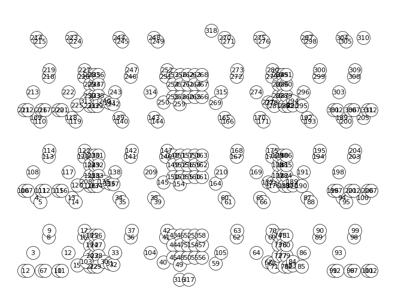

# XF-OPT/META
## E**X**perimentation **F**ramework and (Hyper-)Parameter **Opt**imization for **Meta**heuristics

This python package provides and easy-to-use and modular framework for implementing metaheuristic algorithms and corresponding problems (e.g., TSP, QAP). Futhermore it provides functions/modes for optimizing the paramters used in the metaheuristics using Hyperparamter optimization algorithms (e.g., Random Search), analyzing multiple runs of an implemented metaheurisitc algorithm or simply running said algorithm interactively.

### 1. Overview

As of now, the package provides a CLI-based control over its features.
Following the installtion instructions, one should be able to start the programm using:
```
python main.py
```
Please refer to the help section for information on the optional parameters:
```
python main.py -h
```

There are three pre-definded use cases:

- Run Mode (--mode run, default)
- Experimentation Mode (--mode exp)
- Optimization Mode (--mode opt)

Each case is provided with a default TSPLIB problem instance (rat195), that can be changed as well, even using different problem types, like QAP for example.

That being said, the package constists of multiple python modules/classes, that can be used interchangeably and connected as neccesary without the use of the CLI.

A web-based user interface and dashboard for graphs is also planned.

### 2. Installation

***Note:**\
This package only works with Python version >= 3.10.
But, since speed is a major factor, when it comes to metaheuristics, Python version 3.11 is recommended due to even further performance improvements.*

Start by cloning the repository to your local system.
Then, open a terminal in the `/src` directory, where the python code is located, and install the dependencies, either directly via pip
```
pip install -r requirements.txt
```
or using you favorite python environment manager (e.g., venv or conda).

Now you are ready to start the script using
```
python main.py
```


### 3. Experimental Setup and Tests

## 3.1. Choice of problem instances
For the problem instance category, the symmetric TSP was chosen, not only because it relates to previous work done with this algorithm (see paper), but also because it can be generalized to lots of different, relevant problems, especially in logistics. 

The TSP instance test cases will be of the popular TSPLIB, since they are tried and tested by lots of publications and also have the benefit of having the optimal solution known for each of the problems.
Besides giving the weights in standard 2D Euclidean form, the are also geographical distance problem instances or distance matrices. The thesis will focus on Eucledian 2D instances for simplicity, but the software itself can handle any type of TSP edge weight type.

The thesis will focus especially on the dynamic TSP (as explained in the chapter before). However, the dynamic part is implemented by the package itself, not the TSPLIB.
All TSPLIB instances have varying number of cities (henceforth called dimension) and oftentimes certain characteristics by which the cities are placed in the space, sometimes describes within the TSPLIB file (under COMMENT).
To quantify these instances the mean and median distance between nodes was also calculated. This gives the opportunity to select a meaningful, disjunct subset of problem instances, without using too many, since the computational effort to run the larger instances is pretty significant (more on that later).
The selection of problem instances is influenced by two metrics: dimension and city placement characteristic.
Since this implementation of the HSPPBO algorithm scales linearly with the dimension n, so O(n) time complexity, and the process of hyperparameter optimization runs the algorithm around hundred times, with the optimization being repeated several times for each dynamic configuration and problem instance, the maximum dimension used will be around 400. The lower bound for the dimension n will be 50, since smaller instances, will make it difficult to make out any placement characteristics. This results in dimension bound by the interval [50,450], which is then roughly categorized into smaller instances (50-250 cities) and larger instances (250-450) instances.
The city placement characteristic is determined with the help of the following statistical values calculated for each TSPLIB instance using the corresponding distance matrix:

- mean
- median
- coeff_var: coefficient of variation (https://en.wikipedia.org/wiki/Coefficient_of_variation)
- qdc: quartile coefficient of dispersion (https://en.wikipedia.org/wiki/Quartile_coefficient_of_dispersion)
- R: regularity index (according to [1] and [2])
- eigen1: the first eigenvalue ("close relation to the average length of all Hamiltonian cycles in a TSP instance" according to [3])
- eigen_gap: gap between the first two largest eigenvalues

These values were calculated for all TSPLIB instances with a dimension smaller than 1000 and with a valid edge weight type for the used python package (this excluded ATT, EXPLICIT and CEIL_2D problems).
The results can be found [here](problems/metadata.json).

Three methods for determining the placement characteristic are possible:
1. Using value ranges for the regularity index R to distinct between structures (according to [1] and [2])
2. Using the value ranges of the gap between the first two (largest) eigenvalues to distinct between structures (according to [4])
3. Using KMeans clustering with the parameters qdc, R and eigen1 to automatically generate clusters.

Since methods one and two rely on value ranges, they already give the inherent structural property of each value range. These are:
- heavy_cluster
- semi_cluster
- random
- semi_regular
- regular

Researching and applying each of these methods resulted in a mixed outcome. 
The first method was first validated according to the data from [1] and [2]. The test instances used for that were from the Tnm test dataset by the University of Bonn ([example](problems/tsp/visualizations/Tnm52.png)) and a triangle lattice generated via the python NetworkX package. The Tnm instances were used to reproduce the R values from [2], while the triangle lattice indeed proofed to have an R value of 2 according to [1].
With that foundation established, the first method worked generally well, being able to categorize each problem into a satisfying group. But, it was heavily influenced by artificial patterns, such as pcb442 or ts225, classifying these as randomly distributed (R=1).

The second method proved unpractical to implement, since it could not be directly calculated on the distance matrix and instead would use its Laplacian matrix. The paper [4] also bases its theory upon a positive semi-definite matrix, which the distance matrix is not.

The third method resulted in pretty consistent clusters and even managed to separate most of the artificial patterns from the rest, especially through the use of the eigenvalue. 
However, due to the nature of KMeans clustering, there are no resulting structural properties implied for the generated clusters. One could only imply the above mentioned structural properties by looking at the ranges and visualizations for the instances being clustered together.

The methods one and three can also be reproduced by executing the `create_problem_cluster` method of the Analyzer class.

The results, being the clustered groups, can be found [here](problems/clusters.json).
The 3D scatter plot of the instances over the three cluster parameters, qdc, R and eigen1, with resulting KMeans label as color, is shown here:

The separation between instances shown in the scatter plot are pretty profound, with only the red and orange cluster looking a bit loosely tied together.

Nevertheless, the third method is convincing in most aspects, making it an improvement to mere value ranges in the first method. That is why, going forward, the results of the clustering method will be used to categorize the structure of the problem instances. 

To do that, the clustered groups first need to be referenced to a structural property, as explained above.
This is done inspecting the value ranges for R, as in the first method, the first eigenvalue and by looking at the visualized instances, to spot common patterns or verify the implications from R or the qdc value.

The resulting structural groups are:
1. Random to almost regular distribution
    - note: this group is consistent with the exception of a280, which would rather fit in group three
    - distinctive value ranges: R > 0.9
    - examples: [eil51](problems/tsp/visualizations/eil51.png), [rat195](problems/tsp/visualizations/rat195.png)
2. Smaller lightly clustered areas with otherwise randomly distributed structure
    - distinctive value ranges: R ∈ [0.55, 0.9] and eigen1 < 500000
    - examples: [berlin52](problems/tsp/visualizations/berlin52.png), [gil262](problems/tsp/visualizations/gil262.png)
3. Artificially structured with certain patterns having medium-clustered regions, with small, distinct holes within the distribution
    - note: this group is consistent with the exception of bier127, which would rather fit in group two
    - distinctive value ranges: R ∈ [0.55, 0.9] and eigen1 > 500000
    - examples: [pr136](problems/tsp/visualizations/pr136.png), [lin318](problems/tsp/visualizations/lin318.png)
4. A few heavily clustered areas
    - distinctive value ranges: very high first eigenvalue (eigen1 > 1700000)
    - examples: [pr226](problems/tsp/visualizations/pr226.png), [pr439](problems/tsp/visualizations/pr439.png)
5. Spaced-out, and heavily clustered areas with little or no city nodes in between
    - distinctive value ranges: R < 0.6 and qdc > 0.5
    - examples: [d198](problems/tsp/visualizations/d198.png), [fl417](problems/tsp/visualizations/fl417.png)

These 10 examples, will also be used within the thesis, as they cover each of the structural groups with a smaller and a larger instance. Shown here are the visualizations of these instances:

| Group/Size |  Smaller instances [50,250]                | Larger instances [250,450]                 |
|------------|--------------------------------------------|--------------------------------------------|
| 1          |  |  |
| 2          |  |  |
| 3          |  |  |
| 4          |  |  |
| 5          |  |  |


[1] Dry, Matthew; Preiss, Kym; and Wagemans, Johan (2012) "Clustering, Randomness, and Regularity: Spatial Distributions and Human Performance on the Traveling Salesperson Problem and Minimum Spanning Tree Problem," The Journal of Problem Solving: Vol. 4 : Iss. 1, Article 2. 

[2] G. C. Crişan, E. Nechita and D. Simian, "On Randomness and Structure in Euclidean TSP Instances: A Study With Heuristic Methods," in IEEE Access, vol. 9, pp. 5312-5331, 2021, doi: 10.1109/ACCESS.2020.3048774.

[3] Cvetković, Dragoš, et al. "THE TRAVELING SALESMAN PROBLEM." Bulletin (Académie serbe des sciences et des arts. Classe des sciences mathématiques et naturelles. Sciences mathématiques) 43 (2018): 17-26.

[4] Lovász, László Miklós. “Eigenvalues of graphs.” (2007).


